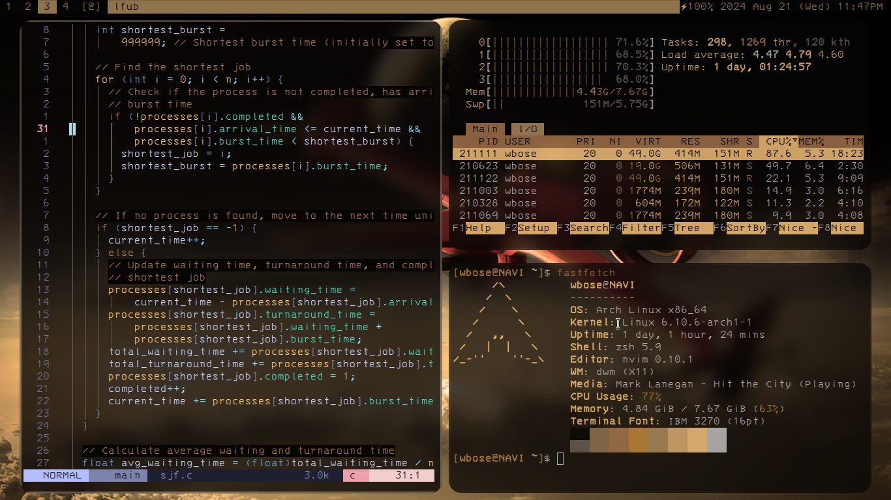

# Dotfiles
My personal dotfiles.

## What's Included

- **Window Manager, Terminal, and Status Bar**:
  - **dwm** (Dynamic Window Manager), **st** (Simple Terminal), and **dwmblocks** are customized versions based on the great work of [Luke Smith](https://github.com/LukeSmithxyz). For more details, check out his repositories:
    - [dwm](https://github.com/LukeSmithxyz/dwm)
    - [st](https://github.com/LukeSmithxyz/st)
    - [dwmblocks](https://github.com/LukeSmithxyz/dwmblocks)
    - [dmenu](https://github.com/LukeSmithxyz/dmenu)
- **File Manager**:
  -   [lf](https://github.com/gokcehan/lf).

- **Text Editor**:
  - [Neovim](https://github.com/neovim/neovim.git),enhanced with [LazyVim](https://github.com/LazyVim/LazyVim). 

## Screenshot

Here’s a screenshot of my setup:

